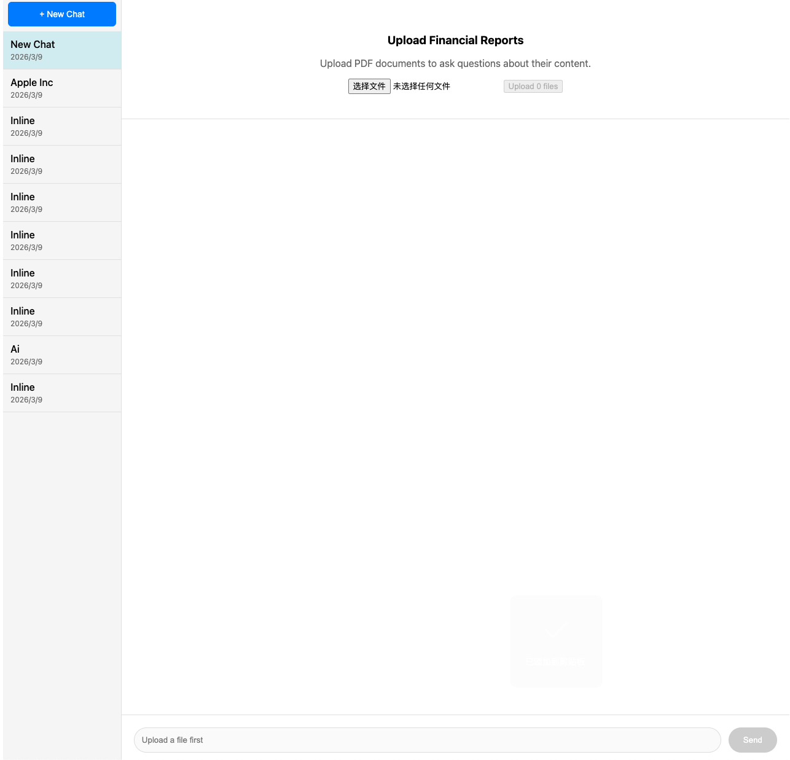
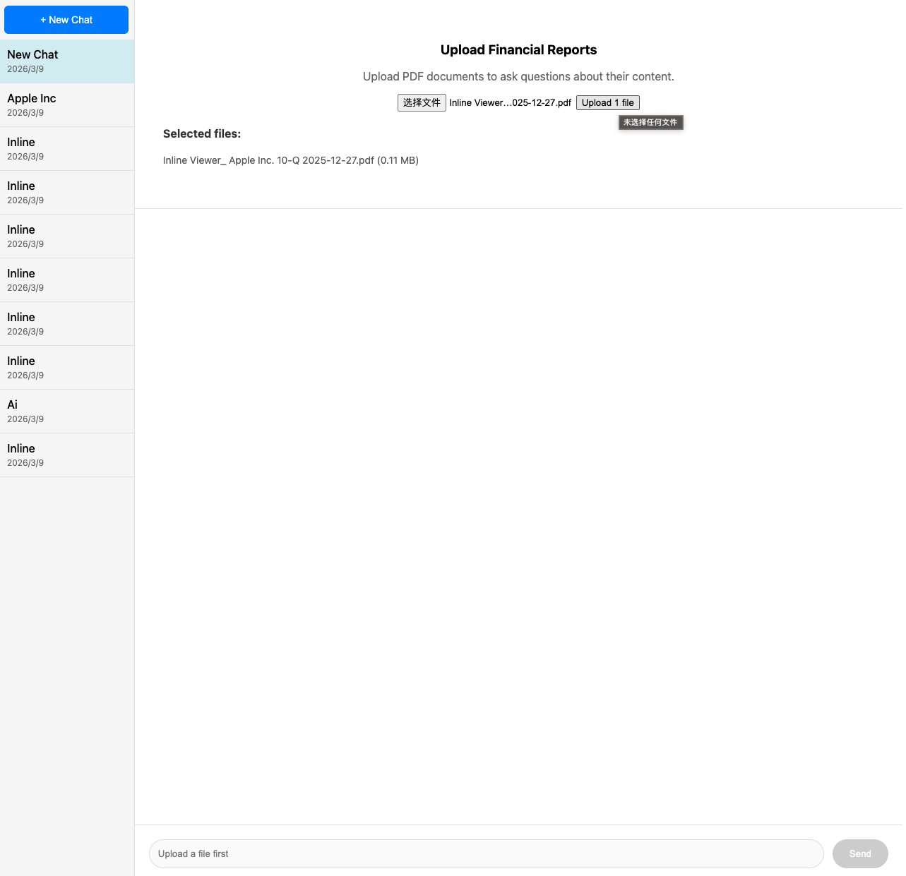
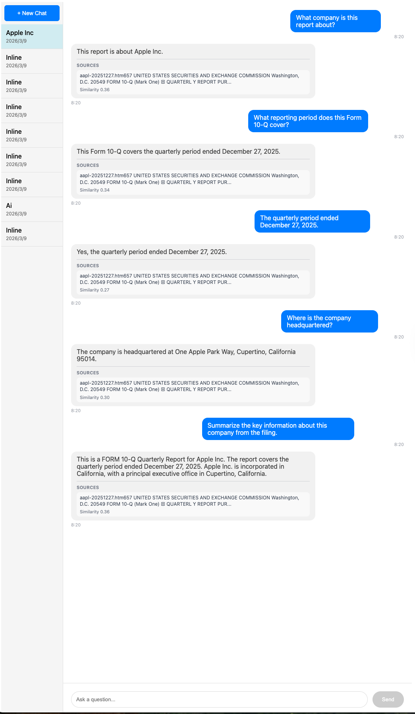
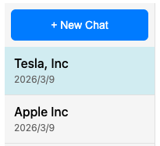

# AI Financial Research Assistant

A full-stack RAG application that lets users upload financial reports and ask grounded questions using document retrieval and Gemini-based answer generation.

## Demo

### Before and After Upload



### Grounded chat response


### Chat renamed by detected company


## Features

- Upload SEC filings and financial reports in PDF format
- Extract, chunk, and embed document content
- Retrieve relevant sections using vector similarity
- Generate grounded answers with Gemini
- Persist chat history across sessions
- Rename chats based on detected company names
- Display retrieved source snippets with answers

## How It Works

1. The user uploads a financial report in PDF format.
2. The backend extracts text and splits it into chunks.
3. Each chunk is converted into an embedding vector and stored for retrieval.
4. When the user asks a question, the query is embedded using the same embedding service.
5. The system retrieves the most relevant document chunks.
6. Retrieved context is passed to Gemini for grounded answer generation.
7. The frontend displays the answer and relevant source snippets.

## Architecture

```mermaid
flowchart LR
    A[React Frontend] --> B[FastAPI Backend]
    B --> C[PDF Text Extraction]
    C --> D[Chunking]
    D --> E[Embedding Service]
    E --> F[Vector Store / Retrieval]
    F --> G[Gemini Generation]
    G --> B
    B --> A

## Setup

### Backend
```bash
cd backend
python -m venv venv
source venv/bin/activate
pip install -r requirements.txt

GEMINI_API_KEY=your_api_key_here
GEMINI_MODEL=gemini-2.5-flash

PYTHONPATH=. uvicorn app.main:app --reload --port 8000

cd frontend
npm install
npm run dev

Make sure the commands actually match your repo.

---

## 8. Example usage
This is underrated. It helps people understand what the app does.

```md
## Example Questions

- What company is this report about?
- What reporting period does this Form 10-Q cover?
- Where is the company headquartered?
- What risks are mentioned in the report?
- Summarize the main financial highlights.

## Limitations

- Current retrieval quality depends on the local embedding backend
- The system is optimized for single-document chat sessions
- Financial metric extraction is not yet structured into tables
- Source citations are currently snippet-based rather than page-anchored

## Future Improvements

- Support multi-document comparison across multiple filings
- Upgrade embeddings to a stronger sentence-transformer backend
- Add page-level citations and source highlighting
- Extract structured financial metrics such as revenue and EPS
- Add persistent document storage and chat-level document linking
